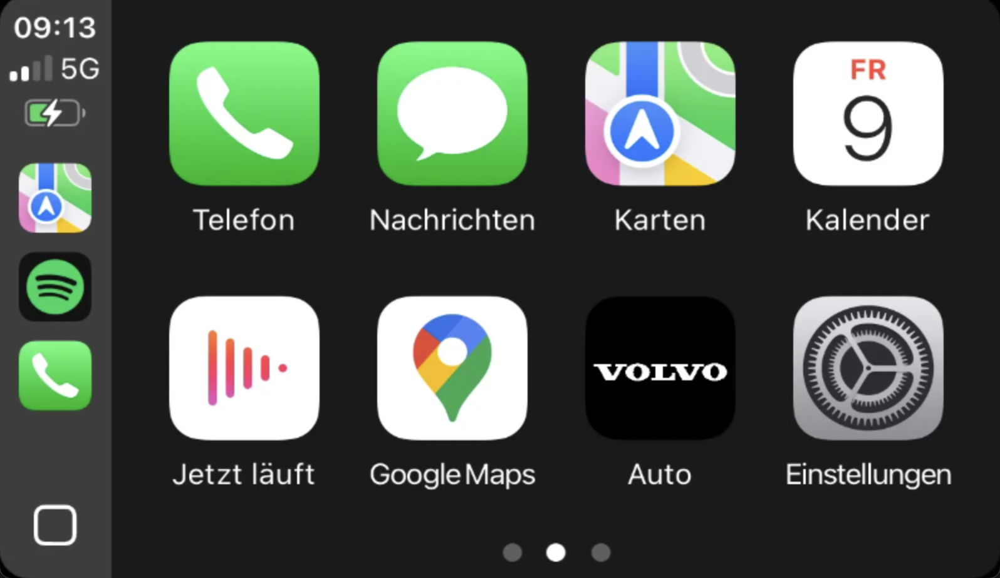
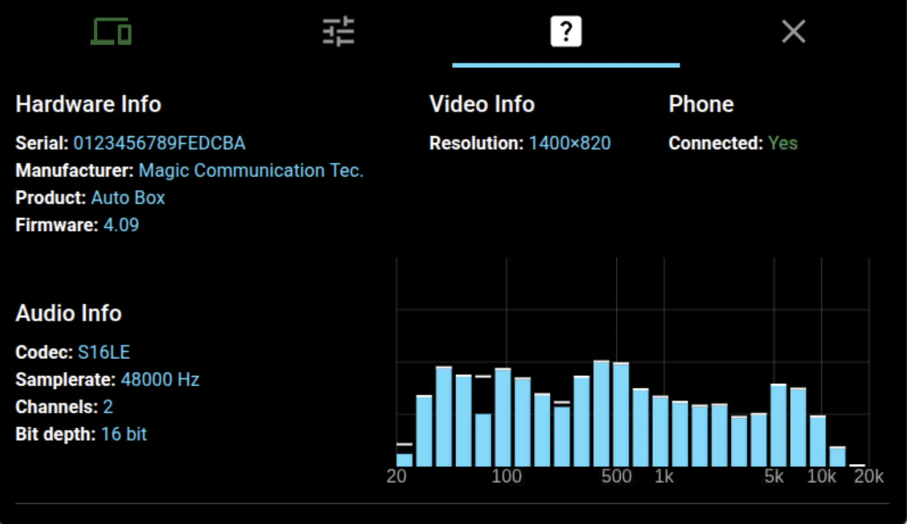

# pi‑carplay

**pi‑carplay** is built on top of Rhys Morgan’s awesome [react-carplay](https://github.com/rhysmorgan134/react-carplay) project, tailored specifically for the Raspberry Pi.
It delivers Apple CarPlay functionality to your Pi with minimal setup.

> **Requirements:** A Carlinkit **CPC200-CCPA** (wireless & wired) or **CPC200-CCPW** (wired only) adapter.


## 📦 Installation

```bash
git clone https://github.com/f-io/pi-carplay.git
cd pi-carplay
./setup-pi.sh
```

The `setup-pi.sh` script will:

1. Install required dependencies
2. Configure udev rules
3. Download the latest AppImage
4. Create an autostart entry

## 📷 Images  
<p align="center">
  
  &emsp;&emsp;
  
</p>

## 🔗 Links

* **Repository & Issue Tracker:** [f-io/pi-carplay](https://github.com/f-io/pi-carplay)
* **Original Project:** [react-carplay by Rhys Morgan](https://github.com/rhysmorgan134/react-carplay)

## 📝 License

This project is licensed under the MIT License.
