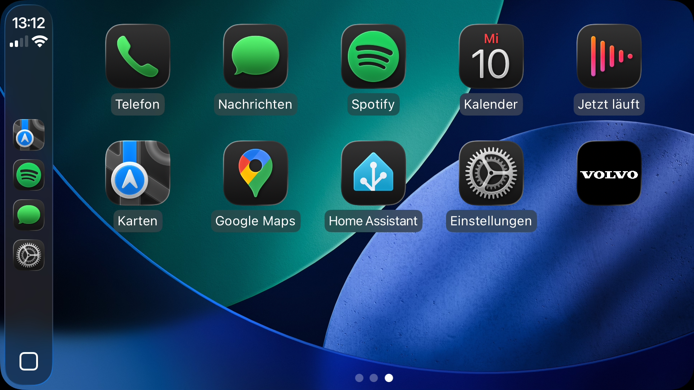
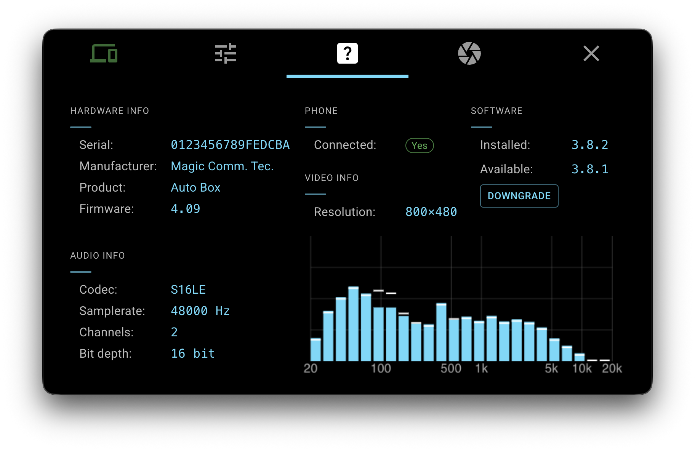

# pi‑carplay

pi‑carplay brings Apple CarPlay functionality to the Raspberry Pi.
While it started as a fork of react-carplay, it has since evolved into a standalone implementation with a different focus.

🎯 Optimized for embedded Raspberry Pi setups and ultra-low-resolution displays

> **Requirements:** A Carlinkit **CPC200-CCPA** (wireless & wired) or **CPC200-CCPW** (wired only) adapter.

<p align="center">
  <!-- Release -->
   &nbsp;
  <!-- MAIN -->
  
  
   &nbsp;&nbsp; &nbsp;&nbsp;
  <!-- DEV -->
  
  
  
</p>


## Installation (Raspberry Pi OS)

```bash
git clone https://github.com/f-io/pi-carplay.git
cd pi-carplay
./setup-pi.sh
```

The `setup-pi.sh` script will:

1. Install required dependencies
2. Configure udev rules
3. Download the latest AppImage
4. Create an autostart entry

*Do not run this script on other Linux distributions.*

## Images
<p align="center">
  
</p>

<p align="center">
  
  &emsp;&emsp;
  
</p>

## Build Environment

```bash
node -v
v22.16.0

npm -v
10.9.2
```

---

### System Requirements (build)

Make sure the following packages and tools are installed on your system before building:

- **Python 3.x** (for native module builds via `node-gyp`)
- **build-essential** (Linux: includes `gcc`, `g++`, `make`, etc.)
- **libusb-1.0-0-dev** (required for `node-usb`)
- **libudev-dev** (optional but recommended for USB detection on Linux)
- **fuse** (required to run AppImages)

---

### Clone & Build

```bash
git clone --branch main --single-branch https://github.com/f-io/pi-carplay.git \
  && cd pi-carplay \
  && npm install \
  && npm run build \
  && npm run build:armLinux
```

---

### Linux (x86_64)

This AppImage has been tested on Debian Trixie (13). No additional software is required — just download the x86_64.AppImage and make it executable.

```bash
chmod +x pi-carplay-*-x86_64.AppImage
```

---

### Mac (arm64)

This step is required for all non-Apple-signed apps.

```bash
xattr -cr /Applications/pi-carplay.app
```

For microphone support, please install Sound eXchange (SoX) via brew.
```bash
brew install sox
```

---

## Links

* **Repository & Issue Tracker:** [f-io/pi-carplay](https://github.com/f-io/pi-carplay)
* **Inspired by:** [react-carplay](https://github.com/rhysmorgan134/react-carplay)

## Disclaimer

** _Apple and CarPlay are trademarks of Apple Inc. This project is not affiliated with or endorsed by Apple in any way. All trademarks are the property of their respective owners._


## License

This project is licensed under the MIT License.

##

<p align="center">
  <strong>☕ Fuel this project</strong><br><br>
  <a href="https://www.buymeacoffee.com/f_io" target="_blank">
    
  </a>
</p>
